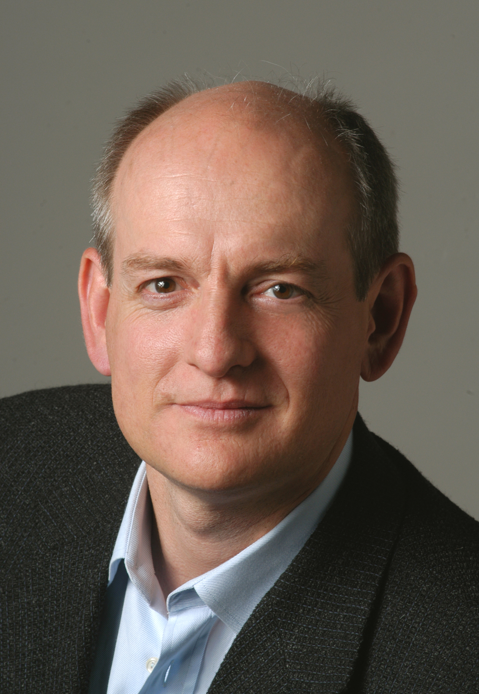

# Inteligencia-Artificial
Inteligência Artificial de Stuart Russel e Peter Norvig

<table class="infobox biography vcard">
<tbody>
<tr>
    <td colspan="2"> 
</td>

</tr>
<tr>
<th scope="row">Nascido</th>
<td>

 Stuart Russel

 1962&nbsp;(age&nbsp;64) 
    
<a title="Portsmouth" href="https://en-wikipedia-org.translate.goog/wiki/Portsmouth?_x_tr_sl=en&_x_tr_tl=pt&_x_tr_hl=pt&_x_tr_pto=tc">Portsmouth, Hampshire</a>, Inglaterra

</td>
</tr>

<tr>
<th scope="row">Nacionalidade</th>
<td class="category">Britânico; Americano</td>
</tr>

<tr>
<th scope="row">Conhecido&nbsp;por</th>
<td>

<ul>
    <li><em><a tittle="Inteligência Artificial: Uma Abordagem Moderna" href="https://en.wikipedia.org/wiki/Artificial_Intelligence:_A_Modern_Approach"> Inteligência Artificial: Uma Abordagem Moderna</a></em></li>
</ui>

</td>
</tr>

<tr>
<th scope="row">Formação</th>
<td>

<ul>
    <li><a title="Universidade de Oxford" href="https://en.wikipedia.org/wiki/University_of_Oxford">Universidade de Oxford</a>&nbsp;</li>
    <li><a title="Universade de Standford" href="https://en-wikipedia-org.translate.goog/wiki/Stanford_University?_x_tr_sl=en&_x_tr_tl=pt&_x_tr_hl=pt&_x_tr_pto=tc">Universidade de Stanford</a>&nbsp;</li>
</ul>

</td>
</tr>

</tbody>
</table>

<ul>
    <li><a target="_blank" href="https://github.com/Jgmro/Inteligencia-Artificial/blob/main/Inteligencia-Artificial-3a-Ed-Russell-Stuart-Norvig-Peter.pdf" style="text-decoration:none;">Inteligência Artificial: Uma Abordagem Moderna</a></li>
</ul>

